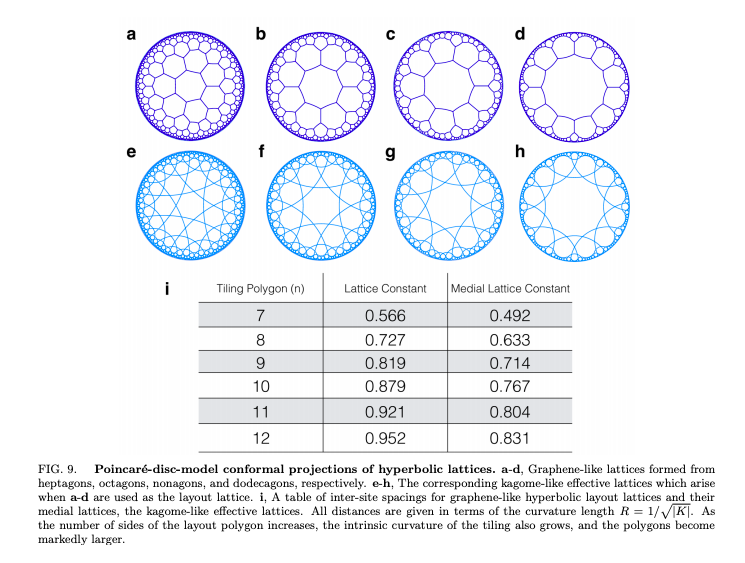
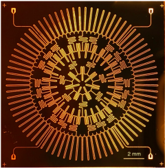

# Intro to Surface Codes

In this notebook we're going to take a look at one of the most widely used and well studied forms of quantum error correction and fault tolerant quantum computing, surface codes. Surface codes are a way of encoding logical qubits into several physical qubits and use topological properties of the connectivity of the qubits to protect against errors. One connection we will need to make clear from the beginning is a connection to number theory and combinatorial topology via so-called "ribbon graphs" or "dessins d'enfants". We devote a separate notebook to this topic so that we can explain how number theory connects to physics via spectral theory of operators, L-functions, partition functions of Ising type models, and in many other ways.

- [Quantum Computation with Topological Codes: from qubit to topological fault-tolerance](https://arxiv.org/pdf/1504.01444.pdf)

- [Constructions and Noise Threshold of Hyperbolic Surface Codes](https://arxiv.org/pdf/1506.04029.pdf)

- [Homological Quantum Codes Beyond the Toric Code](https://arxiv.org/pdf/1802.01520.pdf)

- [Hyperbolic Lattices in Circuit Quantum Electrodynamics](https://arxiv.org/pdf/1802.09549.pdf)

- [Quantum Simulation of Hyperbolic Space with Circuit Quantum Electrodynamics: From Graphs to Geometry](https://arxiv.org/pdf/1910.12318.pdf)

- [Quantum Error Correction for Quantum Memories](https://arxiv.org/pdf/1302.3428.pdf)

- [Ribbon Graphs on nLab](https://ncatlab.org/nlab/show/ribbon+graph)

For a number theoretic and representation theoretic background on how "*dessins*" (equivalently "*ribbon graphs*") are used, and for more information on the combinatorics involved in constructing them, see:

- [SURFACE ALGEBRAS I: DESSINS D’ENFANTS, SURFACE ALGEBRAS, AND DESSIN
ORDERS](https://arxiv.org/pdf/1810.06750.pdf)

- [SURFACE ALGEBRAS AND SURFACE ORDERS II: AFFINE BUNDLES ON CURVES](https://arxiv.org/pdf/1812.00621.pdf)

For more background on the number theory and algebraic geometry involved we refer to [Dessins d’enfants and Origami curves](http://www-users.math.umn.edu/~reiner/Classes/Math8680Fall2014Papers/HerrlichSchmithusenOnDessins.pdf). 

Although there are three dimensional, four dimensional, and even higher dimensional versions of the toric codes and generalizations of surface codes, have a three dimensional or higher architecture is not necessary to implement these generalizations since the interactions of the qubits are still described by a graph. Even though these graphs are embedded in three dimensions or more, every graph can always be embedded in a two dimensional surface and there is a unique minimal genus surface for every graph that allows an embedding without edge crossings. So, while the mathematics of three or more dimensional topological codes may make sense, implementing these codes only ever requires a two dimensional surface, which is always compact for finite topological codes, and is also orientable. The kinds of surfaces needed are well understood in fact, they are just the sphere, along with the n-holed tori where $n \in \mathbb{Z}$ is any positive integer $n \geq 1$. This is also true of the so-called "*hypergraph codes*" (see for example [Higher-dimensional quantum hypergraph-product codes](https://arxiv.org/pdf/1810.01519.pdf)), since every hypergraph can be realized as a bipartite graph embedded in a two-dimensional, compact, orientable surface. 

So, as far as implementation and engineering of topological codes is concerned, we need only understand surface codes, which is what this notebook will focus on. This is not to diminish the importance of these codes or to say that the mathematics involved are not useful, but physical implementations can always be realized as surface codes. For an explanation of this we suggest referring to chapter 1 of [Graphs on Surfaces and Their Applications](https://link.springer.com/book/10.1007/978-3-540-38361-1). Chapter 3 of this book is also a good reference for connections to matrix integrals and quantum gravity. For more on the connection to quantum gravity, one might also read Maxim Kontsevich's paper [Intersection Theory on the Moduli Space of Curves and the Matrix Airy Function](http://pagesperso.ihes.fr/~maxim/TEXTS/Intersection%20theory%20and%20Airy%20function.pdf).

## Applications

Let's have a look at several applications that having an implementation of arbitrary surface codes will likely be useful for.

### Error Correction Using Hyperbolic Surface Codes

Around 1995, Kitaev introduced the [toric code](https://en.wikipedia.org/wiki/Toric_code#:~:text=The%20toric%20code%20can%20also,the%20shape%20of%20a%20torus.), one of the first examples of a *topological quantum error correcting code*. While the toric code is one of the most well studied and understood topological codes, it is by no means the only one. For example, in [Constructions and Noise Threshold of Hyperbolic Surface Codes](https://arxiv.org/pdf/1506.04029.pdf) and [Homological Quantum Codes Beyond the Toric Code](https://arxiv.org/pdf/1802.01520.pdf) general *hyperbolic surface codes* are studied in detail. The error threshold required for such codes is quite good and improved on the threshold for toric codes, which is around $1%$. While these codes may seem somewhat exotic and implementation may seem unrealistic due to the hyperbolic geometry, examples of such quantum chip architecture have been implemented in [Hyperbolic Lattices in Circuit Quantum Electrodynamics](https://arxiv.org/pdf/1802.09549.pdf) with around $150$ qubits. So, implementation of the more general class of surface codes given by "*dessins d'enfants*", i.e. bipartite graphs cellularly embedded in Riemann surfaces is already a useful and necessary endeavour. Having error correction is necessary in general for robust fault tolerant quantum computing, and accomodating exotic and unexpected architectures will provide sufficient generality for experiementation and development of quantum technologies. As examples, see the following images taken from [Hyperbolic Lattices in Circuit Quantum Electrodynamics](https://arxiv.org/pdf/1802.09549.pdf)

Actual Hardware Implementation

### Quantum Gravity

There is a deep connection between hyperbolic surface codes and certain theories of quantum gravity. Some of these connections have been noticed over the years by people such as Edward Witten, Maxim Kontsevich, Alexei Kitaev, John Preskill, Juan Maldecena, and many others too numerous to mention. In Juan Maldecena's explanation of the AdS/CFT correspondence and work by people such as Leonard Susskind on the *Holographic Principle*, it has been made clear that understanding quantum information theory in the context of hyperbolic spaces is a fundamental part of understanding quantum gravity. Being able to simulate quantum dynamics and chaotic systems such as those described by Kitaev will be indespensible in developing our understanding of quantum gravity, which may one day prove to be useful in developing technologies such as the Alcubierre drive for interstellar space travel, which would effectively allow us to travel vast distances "faster" than the speed of light using gravitational waves such as those recently discovered at LIGO, devised in part by the Nobel laureate Kip Thorne. While such goals might seems lofty or unattainable at first, they are legitimized in part by researchers at NASA working on developing the Alcubierre drive technology. To see an example of simulating quantum dynamics in a hyperbolic space using the hyperbolic architecture mentioned above see [Quantum Simulation of Hyperbolic Space with Circuit Quantum Electrodynamics:
From Graphs to Geometry](https://arxiv.org/pdf/1910.12318.pdf). For an explanation of the AdS/CFT correspondence see the [most cited physics paper of all time](https://scholar.google.com/citations?user=jbSdNFUAAAAJ&hl=en), with nearly 20,000 citations as of June 2020, written by Juan Maldecena [The Large N Limit of Superconformal field
theories and supergravity](https://arxiv.org/pdf/hep-th/9711200.pdf).

### QuBitcoin

It is well known by mathematical economists such as Eric Weinstein (see for example [Gauge Invariance, Geometry and Arbitrage]() and [Gauge Theory and Inflation: Enlarging the Wu-Yang Dictionary
to a unifying Rosetta Stone for Geometry in Application](https://www.youtube.com/watch?v=h5gnATQMtPg)), that lattice gauge theory can be used in modeling certain economic processes. One instance of where lattice gauge theory proves useful is in modeling *arbitrage*, which is an essentially risk free way of tading currencies and taking advantage of exchange rates make gains. While cryptocurrency such as Bitcoin and Etherium are technological wonders, they are sometimes highly [vulnerable to arbitrage](https://www.finder.com/cryptocurrency-arbitrage#:~:text=Cryptocurrency%20arbitrage%20allows%20you%20to,where%20the%20price%20is%20high.). This might prove beneficial to someone with ample funds and a fast computer looking to gain wealth quickly, while proving harmful to others. Understanding the vulnerabilities and harm free opportunities means understanding the dynamics of the lattice gauge theory describing cryptocurrency exchange. Such a lattice gauge theory can be modeled by a surface code, and a new form of cryptocurrency, or more accurately an enhancement of current cryptocurrency, "**QuBitcoin**" could be built with quantum physics in mind to moake the currency more stable and robust against attacks. Using machine learning with the quantum dynamics exhibited by a lattice gauge theory modeled on a quantum computer *accurately* and for *very large systems* might improve the ability to predict future behavior of markets and arbitrage opportunities. Predicting such opportunities would of course allow a bad actor to take advantage, but it would also allow a good actor to create more stable cryptocurrency by anticipating vulnerabilities. 

### Mathematics and Cryptography

It is clear that understanding the behavior of prime numbers is central to current cryptographic methods such as RSA public key cryptograph and elliptic curve cryptography. Fundamental to our understanding of the prime numbers is the "*Generalized Riemann Hypothesis*", a [Millenium Prize Problem](https://www.claymath.org/millennium-problems/riemann-hypothesis) of the Clay Mathematics Institue, worth quite a large sum of money if solved. Proposals to models the Riemann hypothesis and its various incarnations as a quantum mechanical system have been proposed by many over the years, so the idea is not new, but understanding so-called L-functions in terms of surface codes seems to be somewhat new, albeit very closely related to other proposals, all of which seems to be capturing only part of the picture. Modeling the the zeros of L-functions using spectral theory and surface codes seems to be a plausible approach to a better understanding of the Riemann Hypothesis. 

As a future development we will need to implement general qudits in Qiskit in order to model arbitrary L-functions as partition functions of Ising type models with zeros corresponding to eigenvalues of the *Hermitian* Hamitonian. Each qudit of dimension $d_k$ will correspond to a length $d_k$ cycle of $\sigma$ and will represent a $d_k$-level quantum system. These will be the *black* nodes of the bipartite dessin. The white nodes will all be qubits, i.e. 2-level quantum systems, corresponding to each 2-cycle of $\alpha$. The dual dessin, with black vertices corresponding to the faces $\phi$, will also have qudits of various dimensions corresponding to cycles of $\phi$. Once this is implemented in Qiskit, we can begin modeling the Generalized Riemann Hypothesis as using the energy levels of this generalized surface code. This correspondence is very similar to the [Lee-Yang Theorem](https://en.wikipedia.org/wiki/Lee%E2%80%93Yang_theorem#CITEREFKnauf1999) and the partition functions of the Ising type model will give the zeros of interest under a mapping of field extensions to this quantum system. In particular, each black node qudit will corresponding to a state space which will be given by a d-dimensional cyclic extension of $\mathbb{Q}$. The gluing of the roots for this extension corresponds to a mapping of each root to a state in a 2-level system (qubit on a white node). The gluing can then be thought of as a unitary matrix on that qubit taking one state to a second state corresponding to a root of the field extension corresponding to the black node at the other end of the edge connected to this white node qubit. Since each qubit can be thought of as a Riemann sphere and the Pauli matrices form a basis for the Lie algera $\mathfrak{su}(2)$ of $SU(2) \cong SO^+(3,1) \cong \mathbb{P}SL(2, \mathbb{C})$ this amounts to an equivalence relation on two points on the Riemann sphere corresponding to these two roots. 

### Quantum Cryptography and MBQC

We have already introduced **Graph States** in the context of [error correction](https://github.com/The-Singularity-Research/error-correction), as well as for *blind quantum computation* and *quantum cryptography* in [another notebook](https://github.com/The-Singularity-Research/graph-state-quantum-cryptography). Graph states are actually just a special case of surface codes, and so can be modeled using surface codes. Blind quantum computing is an area of quantum cryptography which let's a client (Alice), without sohpisticated quantum computing technologies, to transmit her computation to a server (Bob), who can perform her computation on his quantum computer. Blind quantum computing allows one to perform such transaction while protecting privacy. In this notebook we will discuss using graph states for a particular blind quantum computing protocol. We can also use surface codes in "*Measurement Based Quantum Computing*" (MBQC), which is a form of quantum computation that uses graph states. For more info on this see Chapters 4 and 5 of [Quantum Computation with Topological Codes: from qubit to topological fault-tolerance](https://arxiv.org/pdf/1504.01444.pdf). 

### Yang–Mills and Mass Gap Problem

The [Yang–Mills and Mass Gap Problem](https://www.claymath.org/millennium-problems/yang%E2%80%93mills-and-mass-gap) is another one of those (in)famous Clay Mathematics Institute Millenium Problems worth $1$-million dollars. It involved lattice gauge theory as well, and as we have already established, surface codes model a lattice gauge theory (see for example Chapter 3 $\S 5$ of [Quantum Computation with Topological Codes: from qubit to topological fault-tolerance](https://arxiv.org/pdf/1504.01444.pdf)). Perhaps modeling surface codes on quantum computers will provide us with some insight into this problem as well. In particular, we would want to again model L-functions/partition functions involved in [lattice type Yang-Mills Theory](https://www.claymath.org/sites/default/files/ym2.pdf) using surface codes.

### Material Science and Condensed Matter Physics

Since quantum surface codes are naturally a model of topological order, such as is found in the spin-glass model, having and implementation of arbitrary surface codes may allow us to simulate properties of exotic materials and discover new properties of these materials or ways of constructing new materials that will be useful for various applications in materials science. It seemes natural to model materials and train machine learning models on the simulations in the hope that improvements in accuracy and performance of machine learning models can be achieved. For more on how surface codes relate to condensed matter physics see Chapter 3 $\S 7$ of [Quantum Computation with Topological Codes: from qubit to topological fault-tolerance](https://arxiv.org/pdf/1504.01444.pdf).
